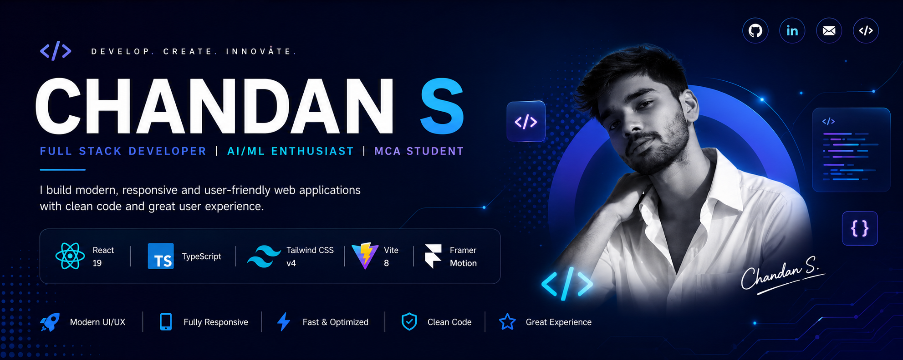

# 👋 Hi, I'm Chandan S

### 💻 Full Stack Developer • AI/ML Enthusiast • MCA Student

 

---

# 📖 About

Welcome to my personal portfolio repository.

This portfolio showcases my journey as a developer through projects, technical skills, certifications, education, and GitHub activity. It is designed with a modern UI, responsive layouts, smooth animations, and an engaging user experience.

---

# ✨ Features

- 🎨 Modern & Clean UI
- 📱 Fully Responsive Design
- 🌙 Dark & Light Theme
- ⚡ Smooth Animations
- 💻 Interactive Hero Section
- 🚀 Project Showcase
- 🔍 Search & Filter Projects
- 🎓 Education Timeline
- 📜 Certifications
- 📊 GitHub Statistics
- 📅 GitHub Contribution Calendar
- 📄 Resume Download
- 📬 Contact Section

---

# 🛠 Tech Stack

---

# 🌐 Live Website

## 🚀 https://chandan-portfolio-1818.vercel.app

---

### ⭐ Thanks for visiting!

If you like this project, consider giving it a ⭐.

